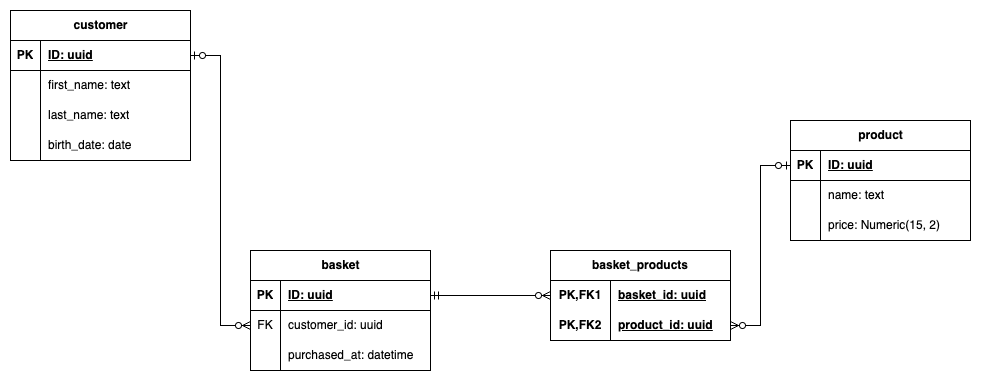
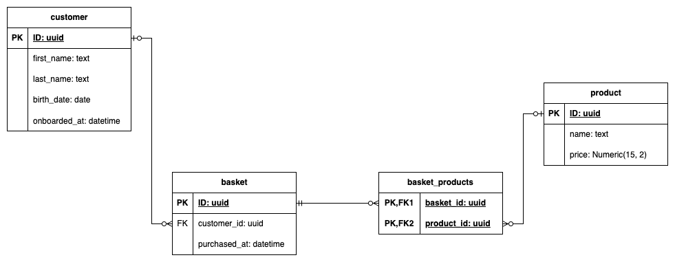

# Architecture and SQL
Welcome to an architecture and SQL exercise. This exercise contains an introduction for context, and
two distinct parts, that can be done in the order you prefer.

## Introduction
We manage an online platform selling products to customers across the globe. To manage the purchases
and sales of products, we have a PostgreSQL database, which is described in this introduction.

Note: the whole existing structure is detailed in a schema at the end of this introduction, or in
the `schema.png` file.

### Customers
Our customers have a very basic representation in our database. They are identified by an UUID, and
we only have information about their first and last names, and their birth date.

### Products
Keeping a simple representation, products are stored with a unique UUID, a name, and a price.

### Baskets
When customers make a purchase, it creates a basket. This basket is linked to the customer that made
the purchase, and contains the time at which the payment was done, all in UTC format to simplify.

Those baskets are linked to products, so that our future data analysts will be able to track the
money people spend, how much articles they buy...

The first data analyst was just recruited, and you are in charge of the API they will need.




## Part one: A new API for the data analyst team
The data analyst team asks three API routes to you:

1. We need an endpoint to track the number of purchases made by each client.
2. We need an endpoint to track the number of times a product is purchased and the money it
   generated in total.
3. We need an endpoint to track the average amount of money a client spends on each purchase.
4. We need an endpoint to know how much money is made each day.

Note: while a little distant from reality, for this exercise, we only need the query made to get the
data from the database.

While it is the reasoning around the queries that interest us, you can test them as follow:

```shell
./run_db.sh
```

In another terminal, run the following command:

```shell
docker compose exec db psql -U postgres
```


## Part two: adding functionalities
Since you arrive at the company, another team introduced a feature tracking the time since a
customer onboarded themself on our product, leading to the new schema.



While those features are interesting, a new business demand arises: who is selling what? You are
asked to add a way to track merchants in our system, so that products can be attached to merchants.

For this, we will consider merchants have a company name and a CEO. We would also like to have some
information about CEOs, such as their name, birth date, country of residence, email and phone
number.


How would you integrate those new constraints into the existing system? What would you need to add
or change?
